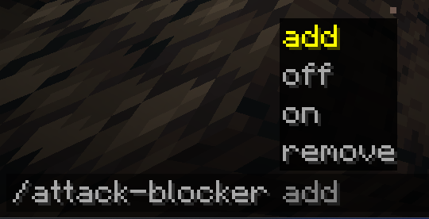

#  Attack Blocker
*By I-No-oNe*
------------------------------

***How to use?***\
*In the minecraft chat write the command `/attack-blocker`*\
*Then you will see the following commands options:*

-------------------------
### In Game Example


```yaml
What Every command does?
# add -> add a player to can't attack list.
# remove -> remove a player from can't attack list.
# off/on -> disable or enable the mod.
```

**BE AWARE THAT YOU NEED TO WRITE THE NAME OF THE PLAYER EXACTLY AS IT WRITTEN**

-------------------------------
***Tysm for using this mod!***\
*Enjoy*