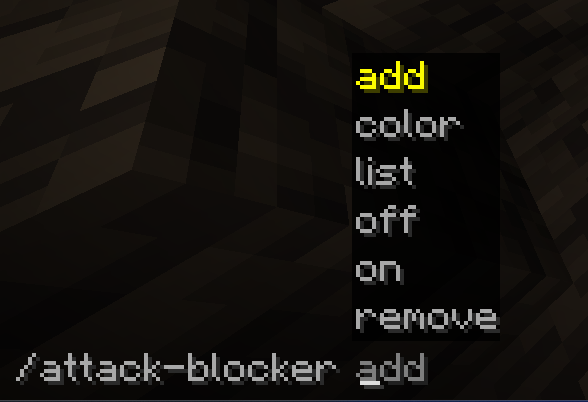

#  Attack Blocker
##### *By I-No-oNe*
------------------------------

*How to use?*\
In the minecraft chat write the command `/attack-blocker`\
Then you will see the following commands options:


-------------------------
```yaml
What Every command does?
# add -> add a player to can't attack list.
# remove -> remove a player from can't attack list.
# off/on -> disable or enable the mod.
# list -> show the players on the can't attack list.
# color -> highlight players who cannot be attack.
```

-----------------------
## In Game Example Of the Mod:

-------------------------------
***Tysm for using this mod!***\
*Enjoy* 😉
